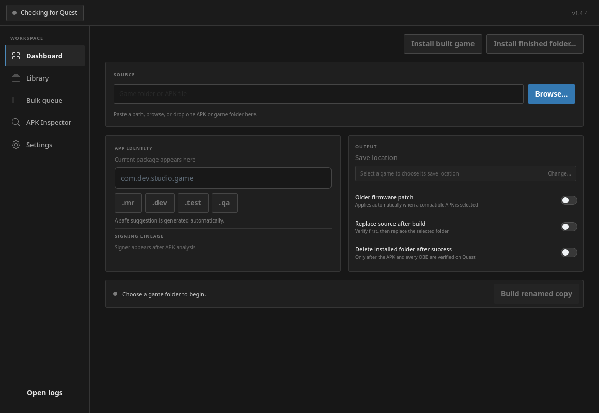
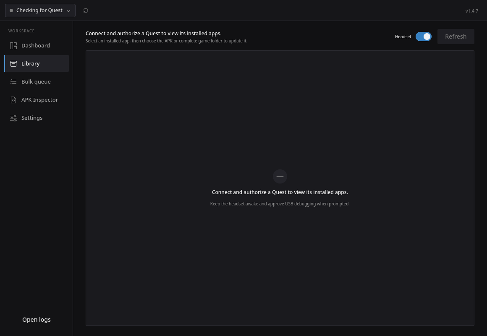
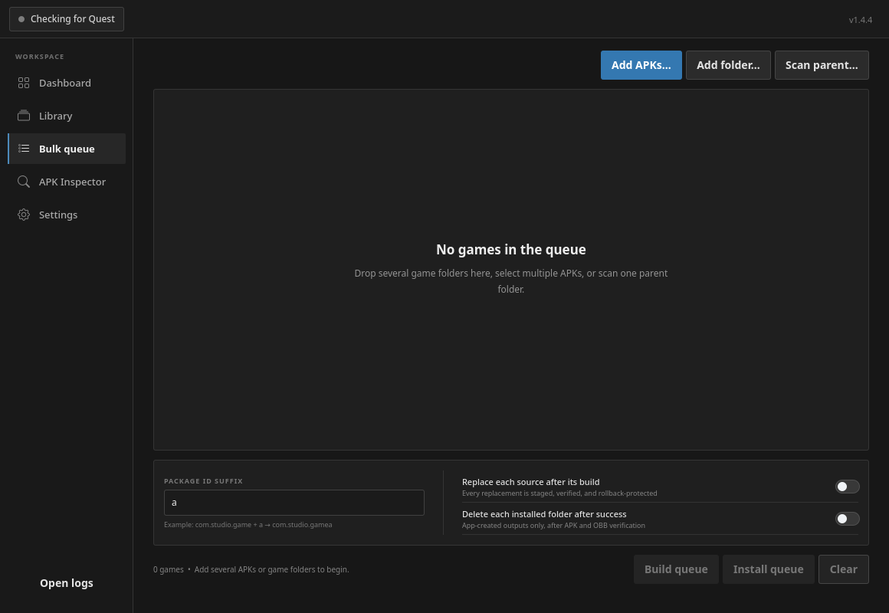
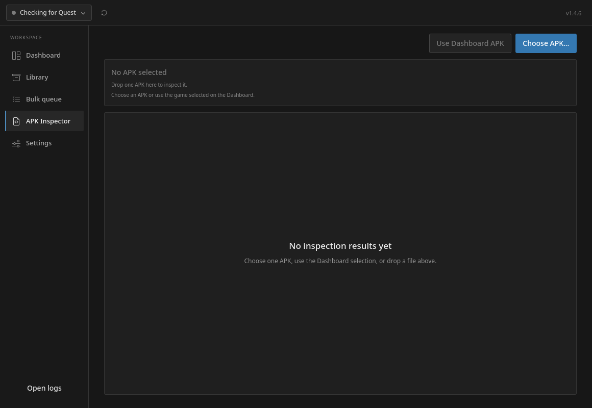
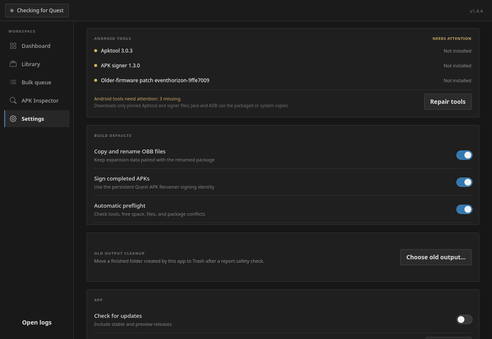

# Quest APK Renamer

[](https://github.com/NotYetFound/Quest-APK-Renamer/releases/latest)
[](https://github.com/NotYetFound/Quest-APK-Renamer/actions/workflows/test.yml)
[](LICENSE)

Give a Meta Quest game you are authorized to modify a **second Android package ID** — so a test
copy can live next to the original — then rebuild, sign, verify, and install it on the headset,
OBB files included. The game name and in-game text stay exactly as they were.

One desktop app for Windows, macOS, and Linux. No command line, no Android SDK setup: Java, ADB,
Apktool, and the signer ship inside the release packages.

> This app was made 100% with AI assistance. Expect bugs, keep backups, and use it with care.



## Download

Get the current stable build from the
[GitHub Releases page](https://github.com/NotYetFound/Quest-APK-Renamer/releases/latest).

| Platform | Recommended download | Alternative |
| --- | --- | --- |
| Windows 10/11 x64 | `Quest-APK-Renamer-1.4.6-Setup.exe` | Portable ZIP |
| Linux x86_64 | AppImage | Portable tarball with launcher installer |
| Apple Silicon macOS | `macOS-arm64.dmg` | — |
| Intel macOS | `macOS-x86_64.dmg` | — |

GitHub shows a copyable SHA-256 digest beside each release download. The Windows package is not
Authenticode-signed and the macOS packages are not notarized yet, so the operating system may show
an unknown-developer warning — see [Platform notes](#platform-notes).

## Quick start

1. **Pick a game** — choose a folder that holds the APK (and its OBB folder), choose one APK, paste
   a path, or drop either onto the window.
2. **Check the new ID** — a safe suggestion such as `com.dev.studio.game` appears automatically;
   use the `.mr` / `.dev` / `.test` / `.qa` presets, type your own, or set a default tag in
   Settings.
3. **Build renamed copy** — the app decodes, rewrites every technical package reference, rebuilds,
   signs with its persistent key, verifies the signature, and writes the result to a sibling
   ` - Renamed` folder together with renamed OBBs, a regenerated `release.manifest`, and readable
   reports. The source folder is never touched unless you enable **Replace source after build**.
4. **Install** — connect the Quest by USB (or Wi-Fi, see below), approve USB debugging once, and
   press **Install built game**. APK and OBBs go over as one verified job with live progress.

## Features

### Dashboard

Automatic analysis (package, version, SDK, ABIs, signer, OBBs, size), a safe ID suggestion, signing
lineage, tool/disk checks, and an explanation of anything still needed before **Build** unlocks.
Open/Copy shortcuts for the source, the save location, the package ID, and error messages; an
elapsed-time counter; keyboard shortcuts (`Ctrl+O` open, `Ctrl+B` build, `Ctrl+R` refresh headset,
`Ctrl+1`–`5` pages, `Ctrl+L` logs). Window size, page, and last-used folders are remembered.

### Headset connection

The header chip shows the Quest's state and free storage. Click it for a connection panel with:

- the attached device (or a list to choose from when several are plugged in — the choice is
  remembered);
- **saved wireless Quests** with one-click connect;
- **Enable wireless ADB over USB**: switches a cabled headset to Wi-Fi ADB, finds its address,
  connects, and remembers it — unplug the cable afterwards;
- **Add address…** for headsets whose Wireless debugging screen shows an `ip:port`.

Settings ▸ Wireless ADB keeps the full list (rename, connect, disconnect, copy the `adb connect`
command, forget) with last-connection times.

### Library

Opens on the connected Quest's user-installed apps and versions; pick one, choose its newer APK or
complete folder, and the update is rebuilt with the saved identity (or installed unchanged for
original-signature apps). The secondary key vault records app name, icon, original and renamed
IDs, and the exact signing key of every signed build, restores them automatically when the same
game is selected again, and exports/imports everything as an integrity-checked `.qarlib` archive.



### Bulk queue

Add several APKs or folders (or scan a parent folder), preview one suffix across the queue, and
build or install everything sequentially. A failed game never stops the rest; each row has Open
and Copy-error actions and the final overview lists every result.



### APK Inspector

An opt-in full decode that reports version/SDK/ABI/locale/component details, file hashes,
signature schemes, certificates, recognized signer and lineage, permissions and features, and the
exact package references a rename would change — using the same token rules as the rewrite, so
`com.example.gamepad` is never mistaken for `com.example.game`. Export as JSON or copy a summary.



### Installation

Storage checks first, then the APK and every OBB as one cancellable job with percentage, transfer
speed, and time remaining. The installed package and remote OBB sizes are verified; failed OBB
transfers can be retried alone. When the headset refuses an APK (`INSTALL_FAILED_UPDATE_INCOMPATIBLE`,
downgrade, storage, …) the app explains why and, for signing conflicts, offers to uninstall the old
copy and install again.

### Settings

Pinned Android tools with integrity state and one-click repair; build defaults (OBB copying,
signing, preflight, default ID tag); wireless ADB and saved Quests; update checks; the signing
identity with backup reminder, default backup folder, integrity-checked backup and atomic restore;
and report-verified cleanup of old outputs.



### Logs

A standalone Logs window follows the current session (pause by scrolling up), keeps a rotating
5 MB log with every tool command and its output (secrets redacted), and **Copy support info**
gathers app, OS, device, tool, and recent-log details for an issue report.

## Platform notes

All packages are built on their own operating system in GitHub Actions. Linux and Windows have
hands-on testing; macOS has more limited real-hardware coverage.

- **Windows** — the installer adds a Start Menu entry; the portable ZIP runs from any folder.
  SmartScreen may warn about an unknown publisher until code signing is configured.
- **macOS** — until the DMGs are notarized, Control-click **Quest APK Renamer**, choose **Open**,
  and confirm the prompt on first launch. Only do this for downloads from this repository.
- **Linux** — AppImage or tarball (`./install.sh` adds a launcher). The headset needs Developer
  Mode and USB debugging; some distributions also need an Android udev rule — the app shows the
  exact guidance when it sees an ADB `no permissions` device.
- **File pickers** use the native dialog on Windows/macOS, `kdialog`/`zenity` on KDE/GNOME, then
  Qt's own dialog as a fallback.

If something fails, please [open an issue](https://github.com/NotYetFound/Quest-APK-Renamer/issues/new/choose)
with **Copy support info** output; reports from less common Linux desktops are especially useful.

## Safety and scope

Use Quest APK Renamer only with applications you own or are authorized to modify. It does not
bypass entitlements, accounts, licensing, or platform security. Re-signing changes the APK
certificate, so Android cannot update an installed copy signed by a different key — keep a private
backup of the signing identity (Settings ▸ Signing identity) before relying on renamed packages.
Review local paths and package details before sharing logs, reports, or `.qarlib` archives.

## Run from source

Python 3.11 or newer is required.

```bash
python -m venv .venv
source .venv/bin/activate          # Windows: .venv\Scripts\activate
python -m pip install -e '.[dev]'
quest-renamer
```

A source checkout needs compatible Java/ADB tools on the system (release downloads bundle them).
Run the same checks as CI:

```bash
ruff check src tests scripts
mypy src
pytest -q
QT_QPA_PLATFORM=offscreen quest-renamer --smoke-test
```

## Project structure

```text
src/quest_renamer/
├── domain/          Pure models, validation, and workflow rules (no Qt)
├── services/        Build, install, device, and platform contracts
├── infrastructure/  Filesystem, Android-tool, ADB, and OS implementations
├── presentation/    QML-facing controllers and asynchronous view state
├── qml/             Qt Quick interface and shared components
└── assets/          Icons and bundled patch assets
```

Long-running APK, ADB, update, and repair work runs outside the interface thread; see
[Architecture](docs/ARCHITECTURE.md), [Packaging](docs/PACKAGING.md),
[Release checklist](docs/RELEASING.md), [Changelog](CHANGELOG.md), and
[Contributing](CONTRIBUTING.md).

Quest APK Renamer is released under the [MIT License](LICENSE). The older-firmware option uses the
pinned [Event Horizon](https://github.com/veygax/eventhorizon) loader; see
[THIRD_PARTY_NOTICES.md](THIRD_PARTY_NOTICES.md) for bundled components.
